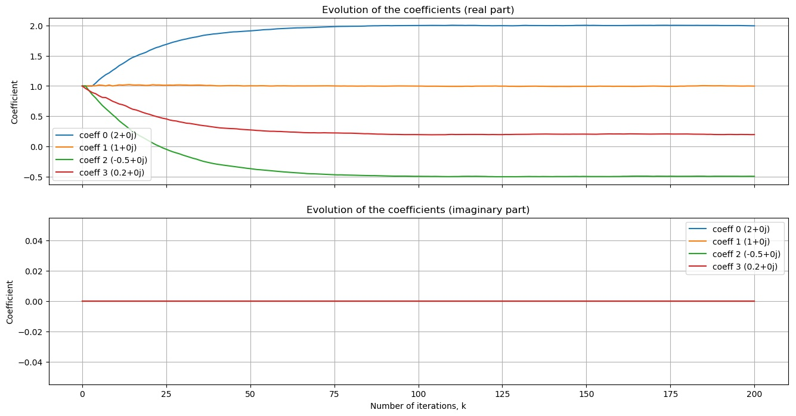
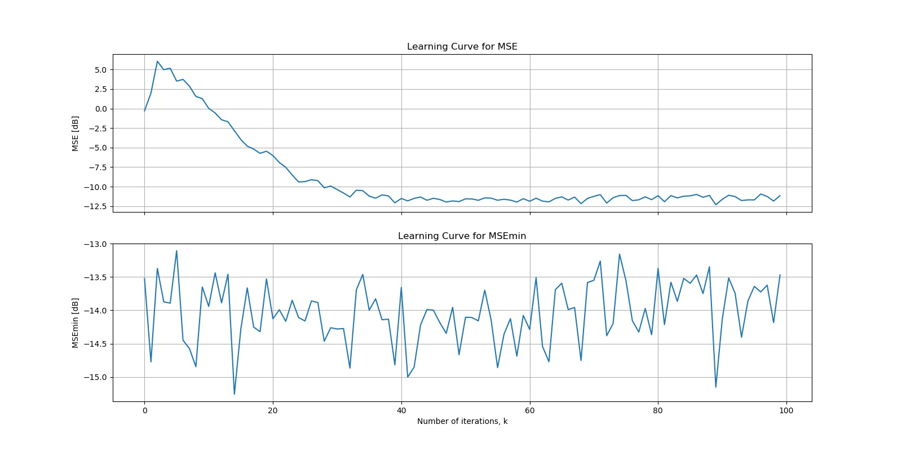

# Adaptive Filtering

Repository containing a Python implemetation of the Matlab [Adaptive Filtering toolbox](http://www.mathworks.com/matlabcentral/fileexchange/3582-adaptive-filtering). 

All classes can be found in the `adaptive_filtering` folder. A notebook containing solutions for exercises in [Adaptive Filtering: Algorithms and Practical Implementation](https://www.springer.com/gp/book/9781461441052) can be found in the `Notebooks` folder. 

## LMS-based Algorithms: 

The following LMS-based algorithms have been implemented:

- LMS (Least Mean Square)
- NLMS (Normalized LMS)
- LMSNewton
- SignData
- SignError
- DualSign

## Examples 

To run examples, check the `Examples` folder. The scripts do not need any arguments through the command line and the outputs are stored by default in the `Examples/Outputs` folder (such filepath can be changed in each script though). 

Take for instance a system identifications where the standard LMS algorithm has to identify the following weights vector (which is also its Wiener Solution): 

$$ \textbf{w}_o = [0.32+0.21j,-0.3+0.7j,0.5-0.8j,0.2+0.5j]^T$$

By running the example with $K = 100$ iterations, $\mu = 0.1$ and taking the average of $25$ ensembles, the following learning curves are provided:

